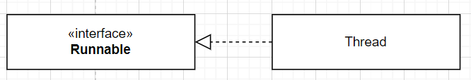
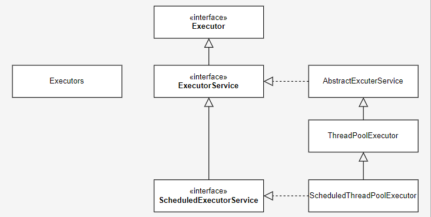

## java concurrency 개인적인 정리 내용
```text
아래 내용은 망나니 개발자님 블로그 글을 보고 기록차원에서 학습 테스트를 진행한 내용입니다.   
상세한 내용의 아래 망나니 개발자님이 글을 보시는 것을 추천합니다.
```
### 망나니개발자 블로그 참고한 내용
- [Thread와 Runnable에 대한 이해 및 사용법](https://mangkyu.tistory.com/258)
- [Callable, Future 및 Executors, Executor, ExecutorService, ScheduledExecutorService에 대한 이해 및 사용법](https://mangkyu.tistory.com/259)
- [CompletableFuture에 대한 이해 및 사용법](https://mangkyu.tistory.com/263)
 

### Thread와 Runnable
> 자바 초기부터 멀티 쓰레드 기반의 동시성 프로그래밍을 위해 만들어졌던 Thread와 Runnable가 있다.
> 단 이러한 방식은 응답을 받을 수 없고, 쓰레드 풀 관리가 되지 않아서 추천하지 않음



#### [ Runnable 인터페의스 ]
> FunctionalInterface 로 run 이라는 abstract method 만 선언되어 있다

```java
@FunctionalInterface
public interface Runnable {
    public abstract void run();
}
```


##### Runnable 인터페이스를 람다형태로 구현해서 run 호출 (메인쓰레드에서 수행)
```java
public class ThreadTest {
    @Test
    void runnableTest() {
        Runnable runnable = () -> System.out.println(Thread.currentThread().getName());
        runnable.run();
    }
}
```

#### [ Thread 클래스 ]
> Thread는 쓰레드 생성을 위해 Java에서 미리 구현해둔 클래스이다. Thread는 기본적으로 다음과 같은 메소드들을 제공한다.

- start : 쓰레드를 JVM이 실행시킴 (메인쓰레드가 아닌 별도의 쓰레드 활용)
- sleep : 현재 쓰레드 멈추기, 자원을 놓아주지는 않고, 제어권을 넘겨주므로 데드락이 발생할 수 있음
- interupt : 다른 쓰레드를 깨워서 interruptedException 을 발생시킴
- join : 다른 쓰레드의 작업이 끝날 때 까지 기다리게 함, 쓰레드의 순서를 제어할 때 사용할 수 있음


##### Thread 를 상속받아 간단한 쓰레드를 호출한다
```java
public class ThreadTest {
    @Test
    void threadTest(){
        // given
        Thread thread = new MyThread();
        thread.start();
    }
    static class MyThread extends Thread {
        @Override
        public void run() {
            System.out.println(Thread.currentThread().getName());
        }
    }
}
```

##### Thread 생성시 Runnable 을 주입하여 멀티쓰레드로 호출할 수 있다 (가장 일반적으로 쓰레드 호출)
```java
public class ThreadTest {
    @Test
    void threadTestByRunnable() {
        Runnable runnable = () -> System.out.println(Thread.currentThread().getName());
        new Thread(runnable).start();
    }
}
```

### 자바 5에서 멀티쓰레드
> 자바5 부터 멀티 쓰레드 기반의 동시성 프로그래밍을 위해 추가된 기능이 있다. 
> Executor, Callable, Future 에 대해 정리


#### Executor, Callable, Future 관계를 보여주는 AbstractExecutorService 구현 부분
- Callable 을 인자로 받고, Future를 응답으로 내려주며, execute 메서드 호출하는데 Executor에 정의된 유일함 메서드이다.
```java
public abstract class AbstractExecutorService implements ExecutorService {
    public <T> Future<T> submit(Callable<T> task) {
        if (task == null) throw new NullPointerException();
        RunnableFuture<T> ftask = newTaskFor(task);
        execute(ftask);
        return ftask;
    }
}
```

#### Callable
> Runnable의 발전된 형태로써, Java5에 함께 추가된 제네릭을 사용해 결과를 받을 수 있는 Callable이 추가

```java
@FunctionalInterface
public interface Callable<V> {
    V call() throws Exception;
}
```
#### Future
> 미래에 완료된 Callable의 반환값을 구하기 위해 사용되는 것이 Future이다.   
> 즉, Future는 비동기 작업을 갖고 있어 미래에 실행 결과를 얻도록 도와준다.

```java
public interface Future<V> {
    
    // 작업을 취소시키며, 취소 여부를 boolean으로 반환함
    boolean cancel(boolean mayInterruptIfRunning);
    
    // isCancelled는 작업의 취소 여부 
    boolean isCancelled();
    
    // isDone은 작업의 완료 여부
    boolean isDone();
    
    // 블로킹 방식으로 결과를 가져옴
    V get() throws InterruptedException, ExecutionException;

    // 타임아웃 설정 가능
    V get(long timeout, TimeUnit unit)
        throws InterruptedException, ExecutionException, TimeoutException;
}
```
- [Future test code](../concurrency/java5/FutureTest.java)

#### Executor 



> Executor 인터페이스는 쓰레드 풀의 구현을 위한 인터페이스이다.  
> 인터페이스 분리 원칙(Interface Segregation Principle)에 맞게 등록된 작업을 실행하는 책임만 갖는다
```java
public interface Executor {
   void execute(Runnable command);
}
```

#### ExecutorService
> Executor 를 상속받은 인터페이스로 작업 등록 뿐만 아니라 실행을 위한 책임도 갖는다.   
> 그래서 쓰레드 풀은 기본적으로 ExecutorService 인터페이스를 구현한다.

```text
ExecutorService가 제공하는 퍼블릭 메소드들은 다음과 같이 분류 가능하다.  
- 라이프사이클 관리를 위한 기능들
- 비동기 작업을 위한 기능들
```

#### 라이프사이클 관리를 위한 기능들
- shutdown: 호출 전에 제출된 작업들은 그대로 실행이 끝나고 종료됨(Graceful Shutdown) 
- shutdownNow: shutdown 기능에 더해 이미 제출된 작업들을 인터럽트시킴
- isShutdown: Executor의 shutdown 여부를 반환함 (대기중인 작업 목록(List<Runnable>)을 반환함)
- isTerminated: shutdown 실행 후 모든 작업의 종료 여부를 반환함
- awaitTermination: shutdown 실행 후, 지정한 시간 동안 모든 작업이 종료될 때 까지 대기함

- [라이프사이클 test code](../concurrency/java5/ExecutorServiceAtLifecycleTest.java)

#### 비동기 작업을 위한 기능들
> ExecutorService는 Runnable과 Callbale을 작업으로 사용하기 위한 메소드를 제공한다.  
> 동시에 여러 작업들을 실행시키는 메소드도 제공하고 있는데, 비동기 작업의 진행을 추적할 수 있도록 Future를 반환한다
- submit: 실행할 작업들을 추가하고, 작업의 상태와 결과를 포함하는 Future를 반환함
- invokeAll: 모든 결과가 나올 때 까지 대기하는 블로킹 방식의 요청, 각각의 상태와 결과를 갖는 List<Future>을 반환  동시에 주어진 작업들을 모두 실행하고, 전부 끝나면 각각의 상태와 결과를 갖는 List<Future>을 반환함
  invokeAny:  가장 빨리 실행된 결과가 나올 때 까지 대기하는 블로킹 방식의 요청, 가장 빨리 완료된 하나의 결과를 Future로 반환받음
- 
- [비동기 작업 test code](../concurrency/java5/ExecutorServiceAtAsynchronousTest.java)
```java
public class ExecutorServiceTest {

    @Test
    void submit() throws ExecutionException, InterruptedException {

        ExecutorService executorService = Executors.newSingleThreadExecutor();
        Callable<String> callable = () -> "test";

        Future<String> submit = executorService.submit(callable);
        String ret = submit.get();

        assertThat(ret).isEqualTo("test");
    }
}
```


### 자바8에 추가된 CompletableFuture
> Future 를 구현한 클래스로 기존의 Future 의 단점을 계선하였다. 
```text
외부에서 완료시킬 수 없고, get의 타임아웃 설정으로만 완료 가능
블로킹 코드(get)를 통해서만 이후의 결과를 처리할 수 있음
여러 Future를 조합할 수 없음 ex) 회원 정보를 가져오고, 알림을 발송하는 등
여러 작업을 조합하거나 예외 처리할 수 없음
```
```text
runAsync, supplyAsync는 기본적으로 자바7에 추가된 ForkJoinPool의 commonPool()을 
사용해 작업을 실행할 쓰레드를 쓰레드 풀로부터 얻어 실행시킨다.   
만약 원하는 쓰레드 풀을 사용하려면, ExecutorService를 파라미터로 넘겨주면 된다.
```
```java
public class CompletableFuture<T> implements Future<T>, CompletionStage<T> {
  ...
}
```

#### 비동기 작업 실행
- runAsync: 반환값이 없는 경우 비동기로 작업 실행 콜, 함수형 인터페이스 Runnable 파라미터로 받음
- supplyAsync: 반환값이 있는 경우 비동기로 작업 실행 콜, 함수형 인터페이스 Supplier 파라미터로 받음 
 
```java
public class CompletableFutureTest {

    @Test
    void runAsync() throws ExecutionException, InterruptedException {
        Runnable runnable = () -> System.out.println("Thread: " + Thread.currentThread().getName());
        CompletableFuture<Void> future = CompletableFuture.runAsync(runnable);
        future.get();
        System.out.println("Thread: " + Thread.currentThread().getName());
    }

    @Test
    void supplyAsync() throws ExecutionException, InterruptedException {
        Supplier supplier = () -> "Thread: " + Thread.currentThread().getName();
        CompletableFuture<String> future = CompletableFuture.supplyAsync(supplier);
        System.out.println(future.get());
        System.out.println("Thread: " + Thread.currentThread().getName());
    }
}
```

#### 작업 콜백
- thenApply: 반환 값을 받아서 다른 값을 반환함, 함수형 인터페이스 Function을 파라미터로 받음
- thenAccpet: 반환 값을 받아 처리하고 값을 반환하지 않음, 함수형 인터페이스 Consumer를 파라미터로 받음
- thenRun: 반환 값을 받지 않고 다른 작업을 실행함, 함수형 인터페이스 Runnable을 파라미터로 받음 

```java
public class CompletableFutureTest {
    @Test
    void thenApply() throws ExecutionException, InterruptedException {

        Supplier supplier = () -> "Thread: " + Thread.currentThread().getName();
        Function<String, String> function = ret -> ret.toUpperCase();

        CompletableFuture<String> future = CompletableFuture
                .supplyAsync(supplier)
                .thenApply(function);
    }

    @Test
    void thenAccept() throws ExecutionException, InterruptedException {

        Supplier supplier = () -> "Thread: " + Thread.currentThread().getName();
        Consumer<String> consumer = ret -> System.out.println(ret.toUpperCase());

        CompletableFuture future = CompletableFuture.supplyAsync(supplier)
                .thenAccept(consumer);
    }

    @Test
    void thenRun() throws ExecutionException, InterruptedException {

        Supplier supplier = () -> "Thread: " + Thread.currentThread().getName();
        Runnable runnable = () -> System.out.println("Thread: " + Thread.currentThread().getName());
        CompletableFuture<Void> future = CompletableFuture.supplyAsync(supplier)
                .thenRun(runnable);
    }
}
```

#### 작업 조합
- thenCompose: 두 작업이 이어서 실행하도록 조합하며, 앞선 작업의 결과를 받아서 사용할 수 있음, 함수형 인터페이스 Function을 파라미터로 받음 
- thenCombine: 두 작업을 독립적으로 실행하고, 둘 다 완료되었을 때 콜백을 실행함, 함수형 인터페이스 Function을 파라미터로 받음
- allOf: 여러 작업들을 동시에 실행하고, 모든 작업 결과에 콜백을 실행함
- anyOf: 여러 작업들 중에서 가장 빨리 끝난 하나의 결과에 콜백을 실행함

```java
public class CompletableFutureTest {

    
}
```